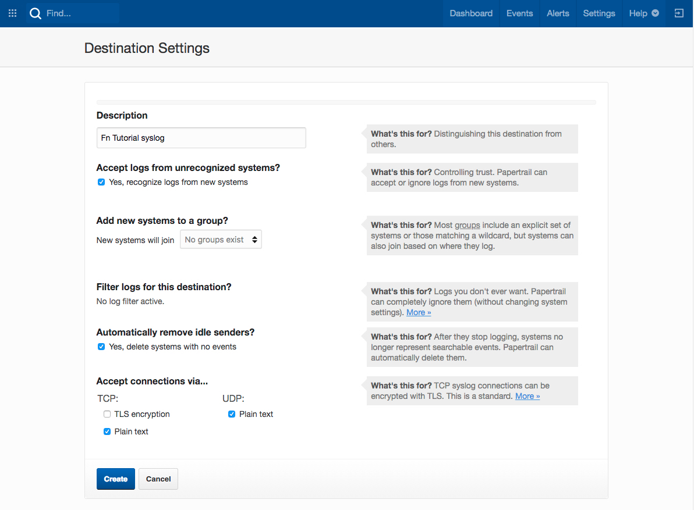
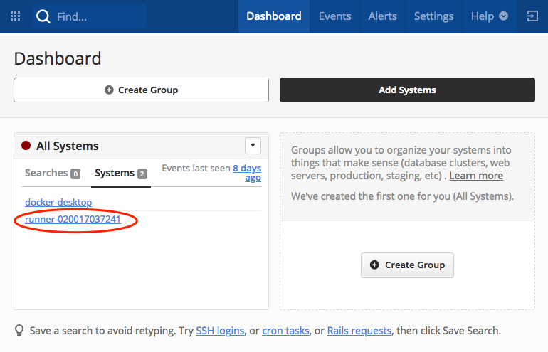
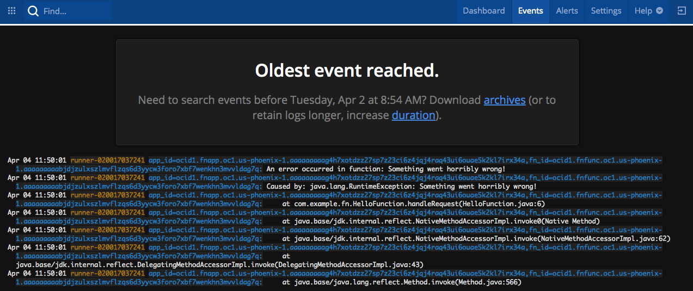

# Troubleshooting and Logging with Fn

Even if you've got excellent unit tests (e.g., using the [Fn Java JUnit
support](https://github.com/fnproject/fdk-java/blob/master/docs/TestingFunctions.md))
things can still go wrong.  Perhaps your function is throwing an exception or
returning unexpected results. So what can you do to troubleshoot your
function?  In this tutorial we'll look at a number of techniques and Fn
features you can use to get to the root cause of your problem.

As you make your way through this tutorial, look out for this icon.
 Whenever you see it, it's time for you to
perform an action.

## Getting Started

First, let's create a simple Java function called `trouble`.  In a new folder
type:


>```sh
> fn init --runtime java trouble
>```

This will create a boilerplate Java hello world function in the `trouble`
folder.  Let's cd into that folder.


>```sh
> cd trouble
>```

And let's delete the unit tests so we can concentrate on the troubleshooting
techniques rather than keeping the tests up to date.


>```sh
> rm -rf src/test
>```

Use the `find` command verify that your directory structure looks like this:


>`find .`

```sh
.
./func.yaml
./pom.xml
./src
./src/main
./src/main/java
./src/main/java/com
./src/main/java/com/example
./src/main/java/com/example/fn
./src/main/java/com/example/fn/HelloFunction.java
```

Ok, we're ready to begin!

## Verbose Mode

When you run commands like `fn build` or `fn deploy` you typically see "progress
dots" (i.e., `...`) that let you know some action is taking place.  Let's build
our function and observe the output.


>```sh
> fn build
>```

You should see something like:

```sh
Building image phx.ocir.io/mytenancy/myuser/trouble:0.0.1 .........................
Function phx.ocir.io/mytenancy/myuser/trouble:0.0.1 built successfully.
```

Perfect!  But if your code can't be built successfully, either not compiling or
failing unit tests, then you get a helpful error message suggesting you rerun
your command with the `--verbose`/`-v` flag.

To see this let's
break the function so it won't compile. Comment out the return statement in the
`HelloFunction` class' `handleRequest` function by putting `//` in front of the
`return` statement so it looks like:


```java
package com.example.fn;

public class HelloFunction {

    public String handleRequest(String input) {
        String name = (input == null || input.isEmpty()) ? "world"  : input;

        //return "Hello, " + name + "!";
    }

}
```

Let's build again and check out the error message.


>```sh
> fn build
>```

Results in:

```
Building image phx.ocir.io/mytenancy/myuser/trouble:0.0.1 .........
Error during build. Run with `--verbose` flag to see what went wrong. eg: `fn --verbose CMD`

Fn: error running docker build: exit status 1

See 'fn <command> --help' for more information. Client version: 0.5.63
```

Now let's try the build with the `--verbose` flag, which you need to put 
*immediately* after `fn` (i.e. `fn build --verbose` will *not* work):


>```sh
> fn --verbose build
>```

Now we see details of the build and the failure (output abbreviated):

```sh
Building image phx.ocir.io/mytenancy/myuser/trouble:0.0.1
FN_REGISTRY:  phx.ocir.io/mytenancy/myuser
Current Context:  workshop
Sending build context to Docker daemon  24.06kB
Step 1/11 : FROM fnproject/fn-java-fdk-build:jdk11-1.0.87 as build-stage
 ---> 668f47f46c7d
...
[ERROR] COMPILATION ERROR :
[INFO] -------------------------------------------------------------
[ERROR] /function/src/main/java/com/example/fn/HelloFunction.java:[9,5] missing return statement
[INFO] 1 error
...
[ERROR] Failed to execute goal org.apache.maven.plugins:maven-compiler-plugin:3.3:compile (default-compile) on project hello: Compilation failure
[ERROR] /function/src/main/java/com/example/fn/HelloFunction.java:[9,5] missing return
...
The command 'mvn package' returned a non-zero code: 1
...
```

With verbose output we see the entirety of the Maven build which includes an
error message telling us we're missing a return statement--as we expected.

When an unexpected error happens, verbose output is the first thing you need to
enable to diagnose the issue.

## Logs

When calling a deployed function, Fn captures all standard error output and
sends it to a syslog server, if configured. So if you have a function throwing
an exception and the stack trace is being written to standard error, it's
straightforward to get that stack trace via syslog.

Let's update our HelloFunction so that it throws an exception in the
`handleRequst` method.  Replace the definition of HelloFunction with the
following:


```java
package com.example.fn;

public class HelloFunction {

    public String handleRequest(String input) {
        throw new RuntimeException("Something went horribly wrong!");
    }

}
```

With this change let's deploy the function and invoke it.


>```sh
> fn deploy --app labapp-NNN
>```

```sh
Deploying trouble to app: labapp-NNN
Bumped to version 0.0.2
Building image phx.ocir.io/mytenancy/myuser/trouble:0.0.2 ......
...
Updating function trouble using image phx.ocir.io/mytenancy/myuser/trouble:0.0.2...
Successfully created function: trouble with phx.ocir.io/mytenancy/myuser/trouble:0.0.2
```

You can verify the function is deployed successfully by listing
the functions of the 'labapp-NNN' app:


>```sh
> fn ls functions labapp-NNN
>```

Or the slightly more economical:


>```sh
> fn ls f labapp-NNN
>```

```sh
NAME      IMAGE                                                 ID
trouble   phx.ocir.io/mytenancy/myuser/trouble:0.0.2  ocid1.fnfunc.oc1.us-phoenix-1.aaaaaaaaabjdjzulxszlmvflzqs6d3yycw3foro7xbf7wenkhn3mvvldag7q
...
```

With the function defined let's invoke it and see what happens when it fails:


>```sh
> fn invoke labapp-NNN trouble
>```

```sh
{"code":"StatusBadGateway","message":"function failed"}
Fn: Error calling function: status 502

See 'fn <command> --help' for more information. Client version: 0.5.63
```

"function failed" is not much information to go on to debug the problem.  What
we need to do is look at the logs!

### Log Capture

> NOTE: In the future, Oracle Functions will be integrated with the OCI Logging
> Service.  Until then, logs can be captured and viewed via the "syslog"
> functionality provided by open source Fn.

To see what's happening when the function fails, we're going to have to capture
its logs.  To do so, we need to configure the `labapp-NNN` application with the
URL of a syslog server.  You can do this when you create an app, or you can
update an existing app.

When creating a new app using the `fn` CLI you can specify the URL using the
`--syslog-url` option as in:

```sh
fn create app labapp-NNN --syslog-url tcp://mysyslogserver.com
```

However, since we've already created the 'labapp-NNN' app, we'll have to update
it using `fn update app`.  But first we'll need a syslog server ready to
receive log data.  For the purposes of this tutorial we'll set up and use a free
[Papertrail](https://papertrailapp.com/) account. Papertrail is a cloud log
management service. To get set up:

1. Sign up for a [free Papertrail
   account](https://papertrailapp.com/signup?plan=free)
2. On the Papertrail website, go to 'Settings' (top right hand corner), click on
   'Log Destinations', and click 'Create a Log Destination'. 
3. In the create dialog, under TCP unselect 'TLS' and under both TCP and UDP
   select 'Plain Text' 
4. Click 'Create' or 'Update'
5. You'll see the address of your log destination displayed on the the
   page looking something like `logs.papertrailapp.com:<PORT>`. Copy this value
   to your clipboard for use in a minute. 

Ok, now that we have a log destination we can update the syslog url of our
application:


>```sh
> fn update app labapp-NNN --syslog-url tcp://[your Papertrail destination]
>```

```sh
app labapp-NNN updated
```

You can confirm that the syslog URL is set correctly by inspecting your
application:


>```sh
> fn inspect app labapp-NNN
>```

Which will return JSON looking something like:

```json
{
	"annotations": {
		"oracle.com/oci/appCode": "k2kl7irx34a",
		"oracle.com/oci/compartmentId": "ocid1.compartment.oc1..aaaaaaaaon25g3kisxyv4k54vvtrxadpbj2bbpetrpcacwax72uhmzpflyua",
		"oracle.com/oci/subnetIds": [
			"ocid1.subnet.oc1.phx.aaaaaaaajedmpudrrbstjsowuzcvzwugcoepj6zjxn6fohrf74z45zrv5hdq"
		]
	},
	"created_at": "2019-04-02T21:46:14.988Z",
	"id": "ocid1.fnapp.oc1.us-phoenix-1.aaaaaaaaag4h7xotdzz27sp7z23ci6z4jqj4raq43ui6ouae5k2kl7irx34a",
	"name": "labapp-NNN",
	"syslog_url": "tcp://mylog.papertrailapp.com:999",
	"updated_at": "2019-04-04T15:48:24.605Z"
}
```

`syslog_url` looks to be pointing to Papertrail so let's rerun our failing
function:


>```sh
> fn invoke labapp-NNN trouble
>```

Of course it still fails.  Let's go over to the Papertrail "Dashboard" page and
click on our "System" to open a page with the log showing our exception.





In the log you can see the stack dump from our exception.  You can leave the
Papertrail log view open while debugging to monitor the log output in near
realtime.  Give it a try!

## DEBUG=1

If you're interacting with functions via the `fn` CLI, you can enable debug
mode to see the full details of the HTTP requests going to the Fn server and
the responses. The `fn` CLI simply wraps the Fn API to make it easier to
manage your applications and functions.

You enable debug mode by adding `DEBUG=1` before `fn` on each command.  For
example try the following:


>```sh
> DEBUG=1 fn ls apps
>```

Which, with debugging turn on, prints the following:

```sh
GET /v2/apps HTTP/1.1
Host: functions.us-phoenix-1.oraclecloud.com:443
User-Agent: Go-http-client/1.1
Accept: application/json
Accept-Encoding: gzip


HTTP/1.1 200 OK
Content-Length: 547
Connection: keep-alive
Content-Type: application/json
Date: Thu, 04 Apr 2019 15:57:19 GMT
Opc-Request-Id: /01D7MH36ZX1BT12G00000070ET/01D7MH36ZX1BT12G00000070EV

{"items":[{"id":"ocid1.fnapp.oc1.us-phoenix-1.aaaaaaaaag4h7xotdzz27sp7z23ci6z4jqj4raq43ui6ouae5k2kl7irx34a","name":"labapp-NNN","annotations":{"oracle.com/oci/appCode":"k2kl7irx34a","oracle.com/oci/compartmentId":"ocid1.compartment.oc1..aaaaaaaaon25g3kisxyv4k54vvtrxadpbj2bbpetrpcacwax72uhmzpflyua","oracle.com/oci/subnetIds":["ocid1.subnet.oc1.phx.aaaaaaaajedmpudrrbstjsowuzcvzwugcoepj6zjxn6fohrf74z45zrv5hdq"]},"syslog_url":"tcp://mylog.papertrailapp.com:999","created_at":"2019-04-02T21:46:14.988Z","updated_at":"2019-04-04T15:48:24.605Z"}]}

NAME		ID
labapp-NNN	ocid1.fnapp.oc1.us-phoenix-1.aaaaaaaaag4h7xotdzz27sp7z23ci6z4jqj4raq43ui6ouae5k2kl7irx34a
```

All debug output is written to stderr while the normal response is written
to stdout so it's easy to capture or pipe either for processing.

## Wrapping Up

That's a brief intro to current techniques available for troubleshooting for Fn.
We'll update this lab as new features become available.

NEXT: [*Automatically invoke Functions using OCI Events*](9-Functions-Invoke-OCI-Events.md), 
UP: [*Labs*](1-Labs.md), HOME: [*INDEX*](README.md)
