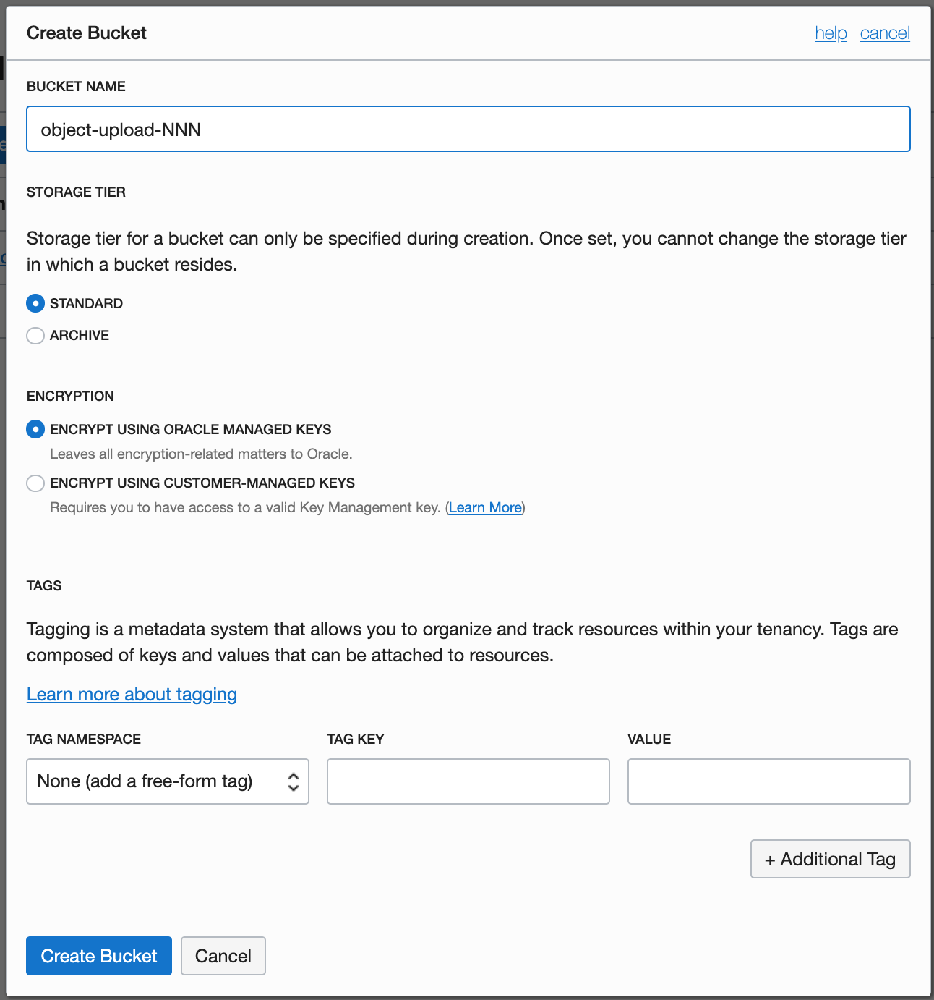
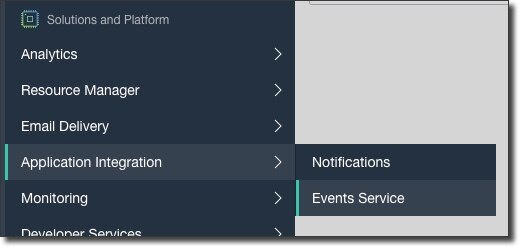
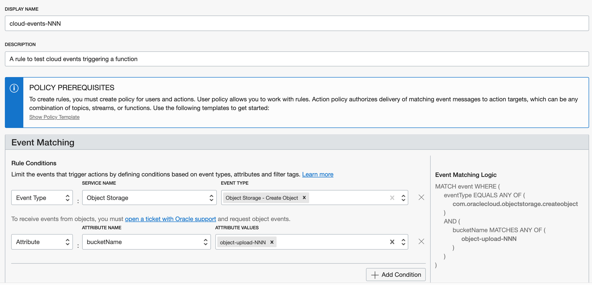

# Invoke Oracle Functions Using OCI Events service

This lab walks you through how to invoke a function deployed to Oracle Functions
automatically using the Oracle Cloud Infrastructure (OCI) Events service. We will 
trigger a function when an object is uploaded to an OCI Object Storage bucket. We 
will use OCI Events service to call our function which will retrieve metadata from 
the image.

## OCI Events service

OCI Events service is a fully managed service that lets you track changes in your 
OCI resources and respond to them using Oracle Functions, Notifications, and Streaming 
services. OCI Events service is compliant with Cloud Native Computing Foundation (CNCF) 
CloudEvents for seamless interoperability with the cloud native ecosystem.


## Create an Object Storage bucket



## Create an OCI Notifications Topic and Email Subscription


Check your email. You will receive an email with the subject "Oracle Cloud Infrastructure Notifications Service Subscription Confirmation". Confirm the subscription by clicking on the link provided in the email. And you will see a "Subscription confirmed" message in the browser. Now this subscription will be in the "Active" state in the OCI console. 

You can test the subscription by clicking on the "Publish Message" button on the topic screen in the OCI console. 

## Create an OCI Event rule

To create a new OCI Event rule, click on Application Integration -> Events Service in 
the sidebar menu:



Click on 'Create Rule' and populate the form:




Note the conditions above. I've selected 'Object Storage' as the 'Service Name' and 'Object Storage - Create Object' as the 'Event Type'. I'm also able to filter the events by attributes - in this case, I'm only interested in uploads to my specific bucket. There are a number of event types and filter possibilities that you can choose from. Refer to the service documentation for more information on the event types and filters. The rest of the form looks like this:


## Create a function

Let's head back to our local terminal to create a function:


>```
> fn init --runtime java cloud-events-demo-fn
>```

The output will be:

>```
> Creating function at: ./cloud-events-demo-fn
> Function boilerplate generated.
> func.yaml created.
>```


>```
> cd cloud-events-demo-fn
>```

Now we will add two dependencies to the pom.xml file. One for the cloudevents-api, 
and another for metadata-extractor so we can extract the image metadata later on. 

 Edit the pom.xml file and add the following dependencies:
>```
> <dependency>
>     <groupId>io.cloudevents</groupId>
>     <artifactId>cloudevents-api</artifactId>
>     <version>0.2.1</version>
> </dependency>
> <dependency>
>     <groupId>com.drewnoakes</groupId>
>     <artifactId>metadata-extractor</artifactId>
>     <version>2.12.0</version>
> </dependency>
>```

Next, lets implement the function to handle the incoming cloud event. Since OCI Cloud 
Events conform to the CNCF Cloud Events specifiation, we can safely type our incoming 
parameter as a CloudEvent and the FDK will handle properly serializing the parameter 
when the function is triggered. Once we have our CloudEvent data we can construct a URL 
that points to our image (a public image in this case) and open that URL as a stream that 
can be passed to the metadata extractor.

 Replace the definition of HelloFunction with the following:
>```
> package com.example.fn;
> 
> import com.drew.imaging.ImageMetadataReader;
> import com.drew.imaging.ImageProcessingException;
> import com.drew.metadata.Metadata;
> import com.fasterxml.jackson.databind.ObjectMapper;
> import io.cloudevents.CloudEvent;
> 
> import java.io.IOException;
> import java.io.InputStream;
> import java.net.URL;
> import java.util.Map;
> 
> public class HelloFunction {
> 
>     public Metadata handleRequest(CloudEvent event) throws IOException, ImageProcessingException {
>         ObjectMapper objectMapper = new ObjectMapper();
>         Map data = objectMapper.convertValue(event.getData().get(), Map.class);
>         Map additionalDetails = objectMapper.convertValue(data.get("additionalDetails"), Map.class);
> 
>         String imageUrl = "https://objectstorage.us-phoenix-1.oraclecloud.com/n/" +
>                 additionalDetails.get("namespace") +
>                 "/b/" +
>                 additionalDetails.get("bucketName") +
>                 "/o/" +
>                 data.get("resourceName");
>         System.out.println("imageUrl: " + imageUrl);
> 
>         InputStream imageStream = new URL(imageUrl).openStream();
>         Metadata metadata = ImageMetadataReader.readMetadata(imageStream);
>         System.out.println(objectMapper.writeValueAsString(metadata));
> 
>         return metadata;
>     }
> 
> }
>```

## Test your function

At this point our test will pass and we can deploy the function to our application with:


## Deploy your function

At this point our test will pass and we can deploy the function to our application with:

fn deploy --app cloud-events-demo

We can manually invoke this by passing our event JSON string:
echo "[event JSON string]" | fn invoke cloud-events-demo cloud-events-demo-fn

And we'll see that our function works as expected. Now let's create the cloud event rule! 


## Update the OCI Event rule

To create a new cloud event rule, click on Application Integration -> Events Service in the sidebar menu:

nav menu > oci events

Click on 'Create Rule' and populate the form:

Note the conditions above. I've selected 'Object Storage' as the 'Service Name' and 'Object Storage - Create Object' as the 'Event Type'. I'm also able to filter the events by attributes - in this case, I'm only interested in uploads to my specific bucket. There are a number of event types and filter possibilities that you can choose from. Refer to the service documentation for more information on the event types and filters. The rest of the form looks like this:

Here we are able to specify the action we would like taken when this cloud event is fired. In this case, we want to call our serverless function, but we could also publish to an Oracle Stream or invoke a notification. Click 'Create Rule' and the rule will be immediately available for use.

Summary

In this lab we created a serverless function to extract image metadata that is automatically triggered upon an image being uploaded to a given object storage bucket. We learned that cloud event rules can be tied to various actions within our OCI tenancy such as Database and Object Storage activities and can automatically trigger serverless functions, notifications or publish items to an Oracle Stream.


