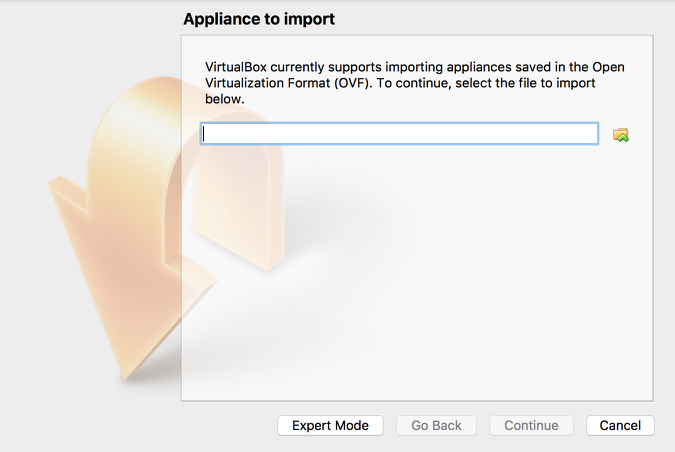
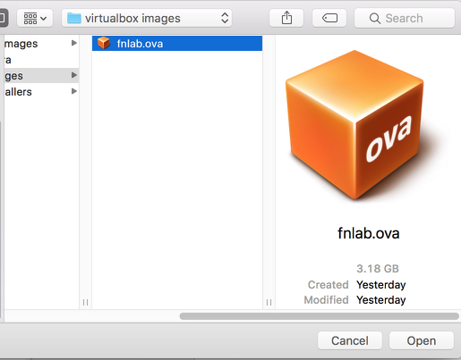
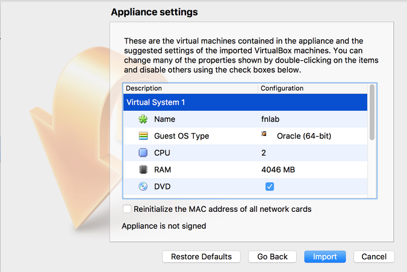
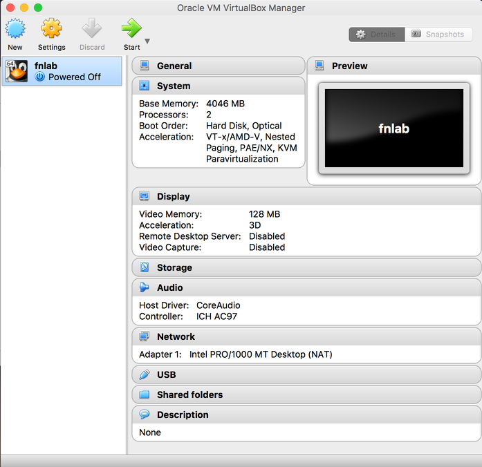
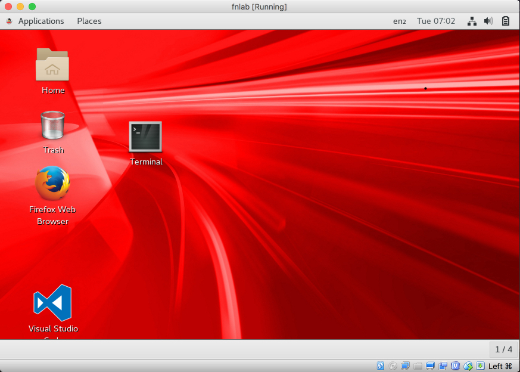

# Lab environment Options

* Install Docker on your personal machine. This is a pre-requisite for the Fn CLI

  **Minimum version = Docker 17.10.0-ce or later**

* Run Docker (and the lab) inside a virtual machine using VirtualBox


Follow the instructions below for each option.

## If you have a Mac, just install Docker:

* [https://docs.docker.com/docker-for-mac/install/](https://docs.docker.com/docker-for-mac/install/)

## If You use Linux:

1. Installation instructions if you use an OCI VM Standard1.1 with Oracle Linux 7.5

```
  ssh -i /Users/amy/ssh-keys/id_rsa opc@<public-ip-of-your-oci-vm>
```

```
  sudo yum install docker-engine
```
 
```
  sudo systemctl start docker
```
 
```
  sudo systemctl enable docker
```

```
  sudo docker version
```
 
```
  sudo usermod -a -G docker opc 
```

```
  logout 
```

```
  Log back in and now you wont need sudo for docker commands:
  
  ssh -i /Users/amy/ssh-keys/id_rsa opc@<public-ip-of-your-oci-vm>
```


```  
  Now you can proceed to install Fn CLI
```


2. [Installation instructions for Oracle Linux 7 with UEK 4](https://docs.oracle.com/cd/E52668_01/E87205/html/section_install_upgrade_yum_docker.html)

3. [For other Linux versions](https://www.docker.com/community-edition)

## If you use Windows, run inside a VirtualBox Virtual Machine

### 1. Install VirtualBox if needed

Your lab instructor may have a USB stick with installers or you can download from
http://www.oracle.com/technetwork/server-storage/virtualbox/overview/index.html

### 2. Import the lab VM appliance

Run VirtualBox and select File>Import Appliance...


Navigate to the folder with the fnlab.ova appliance and select.





Before importing you can review and adjust the settings but the defaults should be fine on a host machine with at least 8GB of RAM.



I can take a few minutes to import the applicance to create a virtual machine.


Once imported you'll see the `fnlab` virtual machine in the VirtualBox Manager.

### 3. Start the lab virtual machine



Select `fnlab` and click the `Start` button to launch the virtual machine
and open a Linux desktop.



Note: sudo user=demo and password=demo

1. Double click on `Terminal` to open a terminal.  Do *not* update when prompted, this is not necessary.

2. Install (or update) the latest `fn cli` run the following command

```
curl -LSs https://raw.githubusercontent.com/fnproject/cli/master/install | sh
```

3. When prompted, enter password for `user: demo` is `demo`.

4. To update the fn server run the following command

```
fn update sv
```


